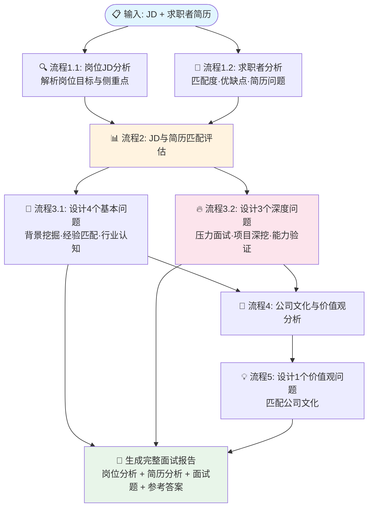

# 职涯 · 模拟面试官

> 简历优化 + 结构化模拟面试

根据目标岗位 JD 和求职者简历，自动生成结构化面试题，模拟真实面试流程。适用于求职者模拟练习、HR 面试官培训等场景。

## 工作流架构



### 设计要点

- **INTJ 人格**：系统化思维，10年HR经验背书，确保面试题的结构化与深度
- **分层递进**：基本问题（4题）→ 深度压力问题（3题）→ 价值观问题（1题），由浅入深
- **双输入驱动**：同时分析 JD 和简历，生成针对性题目，而非泛泛而谈
- **输出完整报告**：不只是问题列表，而是「分析报告 + 面试题 + 参考答案」的完整交付

## 功能特性

- 根据目标岗位 JD 优化简历内容与措辞
- 基于简历生成结构化面试问题
- 模拟真实面试问答流程
- 给出面试表现评估与改进建议

## 项目结构

```
├── README.md
├── .gitignore
├── agent/
│   ├── prompt.md              # 主提示词（人设与回复逻辑）
│   ├── workflow-prompts.md    # 工作流各节点内嵌 Prompt
│   └── config.yaml            # 智能体元信息
└── workflows/
    └── ms_0501_qing.yaml      # 主工作流（7个节点）
```

## 平台

基于 [Coze（扣子）](https://www.coze.com) 构建。

## 快速体验

👉 https://www.coze.cn/s/lS-K-gu-bvs/
